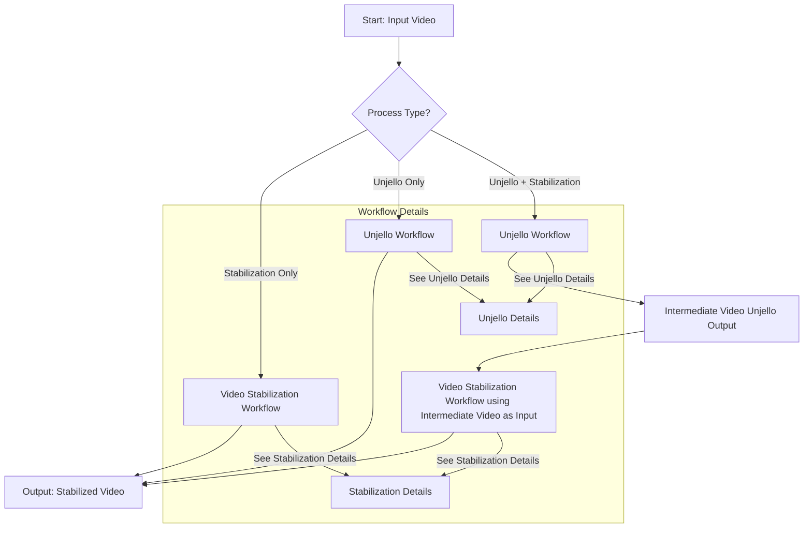
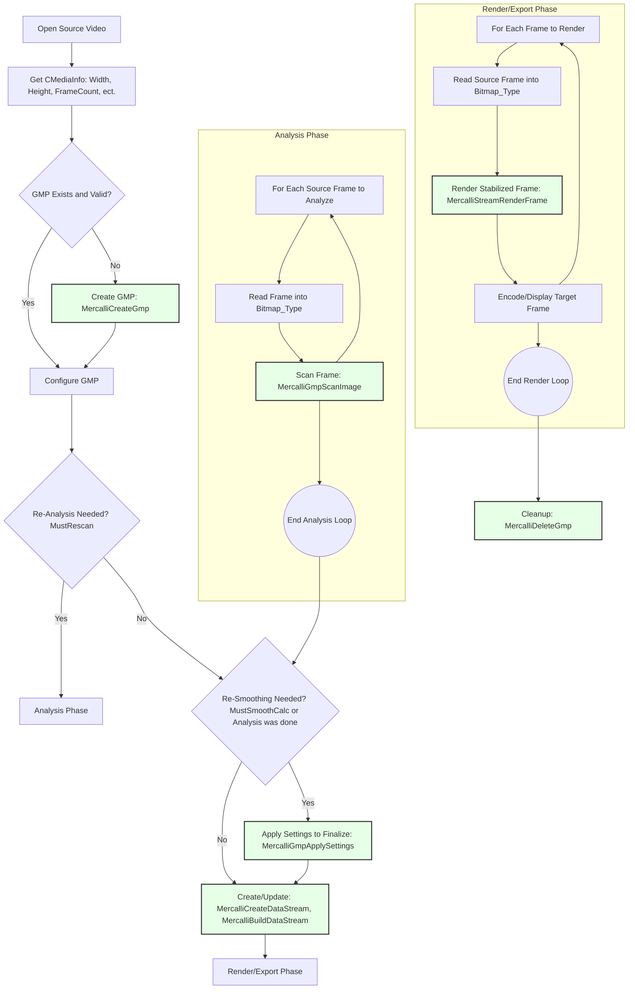
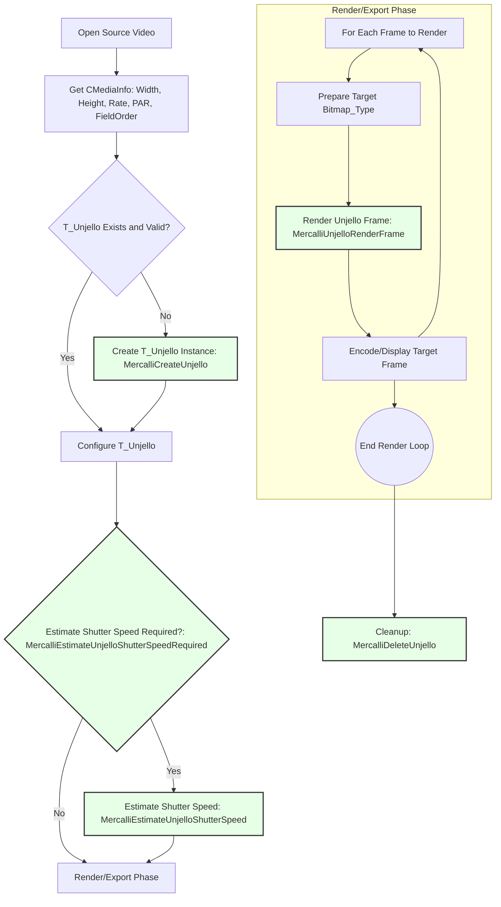

# proDAD Mercalli Video Stabilization SDK
Copyright (&copy;) proDAD GmbH, 2007-2025. All rights reserved.

Version: 6.11 (2025-05-30)

proDAD Mercalli is a powerful video stabilization SDK designed to enhance the quality of video footage by reducing unwanted camera movements and vibrations. It provides advanced algorithms for stabilizing videos captured from various devices, including smartphones, action cameras, and drones. The SDK also includes "Unjello" technology for correcting CMOS sensor distortions (like rolling shutter effects and wobble) and supports fisheye lens correction.

## Contents:
- [Overview](#overview)
- [Contact Information](#contact-information)
- [SDK Preview vs. Full](#sdk-preview-vs-full)
- [SDK Features](#sdk-features)
  - [Key Features](#key-features)
  - [Supported Platforms](#supported-platforms)
- [Files](#files)
- [Quick Start](#quick-start)
- [SDK Usage Models: `MercalliCli` vs. Direct Integration](#sdk-usage-models-mercallicli-vs-direct-integration)
- [Core SDK Concepts](#core-sdk-concepts)
- [Workflow Overviews](#workflow-overviews)
  - [Video Stabilization (Smooth Camera Path)](#video-stabilization-smooth-camera-path)
  - [CMOS Defect Removal (Unjello)](#cmos-defect-removal-unjello)
  - [Combined Workflow: Unjello then Stabilize](#combined-workflow-unjello-then-stabilize)
- [Building the Sample CLI (MercalliCli)](#building-the-sample-cli-mercallicli)
- [Using MercalliCli](#using-mercallicli)
- [Important Notes for Developers](#important-notes-for-developers)
- [Using Mercalli SDK with Python](#using-mercalli-sdk-with-python)
  - [Python Example: Basic Video Stabilization (Conceptual)](#python-example-basic-video-stabilization-conceptual)
- [License Management](#license-management)
- [Troubleshooting / Common Issues](#troubleshooting--common-issues)
- [Process Flowcharts](#process-flowcharts)
    - [Overall SDK Usage Approach](#overall-sdk-usage-approach)
    - [Video Stabilization Workflow (Smooth Camera Path)](#video-stabilization-workflow-smooth-camera-path)
    - [CMOS Defect Removal (Unjello) Workflow](#cmos-defect-removal-unjello-workflow)


## Overview: Your Solution for Professional Video Stabilization and Correction

In the world of video production, from amateur enthusiasts to professional cinematographers, shaky footage is a common enemy. Unwanted camera movements, vibrations, and sensor-induced distortions can significantly degrade video quality, making it appear unprofessional and distracting to watch. The **proDAD Mercalli Video Stabilization SDK** is a comprehensive software development kit engineered to tackle these challenges head-on, empowering developers to integrate robust, high-quality video enhancement directly into their applications.

**What is Video Stabilization?**
At its core, video stabilization is the process of removing or minimizing undesirable camera motion to create a smoother, more stable viewing experience. This can range from correcting minor hand jitters from smartphone recordings to smoothing out aggressive vibrations from action cameras mounted on vehicles or drones.

**Why Mercalli SDK?**
The Mercalli SDK stands out due to its advanced algorithms and a deep understanding of video optics and sensor characteristics. It's not just about simple motion smoothing; it offers a multi-faceted approach to video improvement:

*   **Intelligent Motion Analysis & Path Smoothing**: Mercalli meticulously analyzes the video to distinguish between intentional camera movements (like pans and tilts) and unintentional shakes or vibrations. It then computes an optimized, smoother camera path, resulting in footage that flows naturally without appearing artificially "locked down." This is crucial for maintaining the director's intent while enhancing viewer comfort.

*   **CMOS Sensor Defect Correction ("Unjello" Technology)**: Modern CMOS sensors, while offering many advantages, can introduce specific visual artifacts, especially under fast motion or vibration. These include:
    *   **Rolling Shutter Distortion**: Causes vertical objects to appear skewed or "wobbly" during fast pans.
    *   **Jello Effect**: The entire image seems to oscillate or shimmer.
    *   **Vibrations & Wobble**: High-frequency oscillations that make footage nearly unwatchable.
    Mercalli's "Unjello" technology specifically targets and corrects these CMOS-related issues at a sub-frame level, restoring image integrity.

*   **Comprehensive Lens Distortion Correction**: Wide-angle lenses, including fisheye lenses popular on action cameras and drones, introduce significant geometric distortion (e.g., barrel distortion). The Mercalli SDK can correct these distortions by utilizing detailed camera intrinsic profiles. This results in a more natural, rectilinear perspective, or allows for creative remapping. The SDK includes a library of profiles for many popular cameras and allows for custom profile integration.

**Key Strengths and Advantages:**

*   **Superior Stabilization Quality**: Renowned for producing visually pleasing and natural-looking stabilization, often outperforming simpler or in-camera stabilization methods.
*   **Speed and Efficiency**: Optimized for performance, enabling fast analysis and rendering, with options for GPU acceleration for certain tasks.
*   **Versatility**: Effectively handles footage from a wide array of capture devices, including smartphones, action cameras (GoPro, DJI Osmo Action, etc.), drones, DSLRs, and professional camcorders.
*   **Fine-Grained Control**: Offers extensive parameters for developers to fine-tune the stabilization and correction process, from smoothing strength and border handling to specific CMOS correction settings.
*   **Reduces Post-Production Time**: By providing high-quality automated stabilization, it can significantly reduce the manual effort required in video editing suites.
*   **Enhances Production Value**: Transforms shaky, artifact-laden footage into smooth, clear, and professional-looking video, greatly improving the perceived quality of any production.

**Ideal Use Cases:**

*   **Video Editing Software**: Integrate Mercalli to offer users powerful, one-click stabilization and CMOS correction tools.
*   **Action Camera and Drone Footage Processing Applications**: Provide specialized solutions for optimizing footage from these devices, which are prone to shake and lens distortion.
*   **Live Streaming Applications**: Potentially apply stabilization in near real-time (depending on the chosen settings and system capabilities) to improve live broadcast quality.
*   **Surveillance and Security Systems**: Enhance the clarity and usability of recorded surveillance footage.
*   **Archival and Restoration**: Improve the quality of older or degraded video material.
*   **Mobile Video Applications**: Enable high-quality stabilization directly on mobile platforms.

The proDAD Mercalli SDK provides developers with the tools to deliver a significantly improved video experience to their users, addressing common pain points in video capture and production with sophisticated and reliable technology.


<div style="page-break-after: always;"></div>


## Contact Information:
This Software Development Kit (SDK) is provided under license from proDAD GmbH and may only be used in accordance with the terms of that license.

proDAD GmbH  
Gauertstr. 2  
D-78194 Immendingen, Germany  

Homepage: https://www.prodad.com/  
Author: Holger Burkarth (burkarth at prodad.com)  

<div style="page-break-after: always;"></div>

## SDK Preview vs. Full

This SDK may be available in different distributions: a Preview SDK and a Full SDK. Understanding their differences is important:

*   **Preview SDK**:
    *   **Purpose**: Designed to provide an initial impression of the SDK's capabilities and workflows.
    *   **Contents**:
        *   Typically includes pre-compiled `MercalliCli_static` command-line tools for Windows and Linux. This allows you to test stabilization and Unjello features with your own media files.
        *   Includes the main `mercalli.h` header file to understand the API structure.
    *   **Limitations**:
        *   **Does NOT include the shared libraries** (`.dll` for Windows, `.so` for Linux) or static libraries required to link against and build your own applications incorporating the Mercalli SDK.
        *   May omit some supporting header files (e.g., `proDADobjbase.h`, `proDADGuid.h` if they are part of the broader proDAD framework not directly essential for *understanding* `mercalli.h` in isolation for preview purposes).
        *   Building custom applications using the SDK is generally not supported with the Preview SDK.
        *   Output from the `MercalliCli` tool in the Preview SDK might be watermarked or have other trial limitations.

*   **Full SDK**:
    *   **Purpose**: Intended for full development and integration of Mercalli technology into your applications.
    *   **Contents**:
        *   All necessary header files (`mercalli.h`, `proDADTypes.h`, `proDADGuid.h`, etc.).
        *   The Mercalli SDK shared libraries (e.g., `proDADMercalli5.dll`, `libprodadmercalli.so`) and import/static libraries (e.g., `proDADMercalli5.lib`).
        *   The `MercalliCli` source code and build files to serve as a comprehensive example.
        *   Full documentation.
    *   **Licensing**:
        *   A valid license key, provided by proDAD, **is required** to use the Full SDK in your applications.
        *   Without a valid license, the SDK will typically operate in a restricted mode, often applying a watermark to processed video output. Contact proDAD (sdk@prodad.com) to obtain a commercial license.

> [!NOTE]
> The `README.md` you are currently reading attempts to cover the functionalities as exposed by the SDK's header files, which are more aligned with what a developer using the Full SDK would need. If you only have the Preview SDK, your primary interaction will be with the pre-compiled `MercalliCli_static` tool.

<div style="page-break-after: always;"></div>


## SDK Features:

### Key Features:
-   **Advanced Video Stabilization**: Smooths camera path to reduce camera shake and vibrations.
-   **CMOS Distortion Removal (Unjello)**: Corrects rolling shutter effects, wobble, and jello from CMOS sensors.
-   **Fisheye Lens Correction**: Support for various camera intrinsics to correct distortions from wide-angle and fisheye lenses.
-   **Dynamic Zoom**: Intelligently adjusts zoom to minimize black borders.
-   **Border Handling**: Multiple options for dealing with borders created by stabilization (e.g., Suppress, DynCrop, Forensic).
-   **Hyper-lapse Support**: Optimized profiles for creating smooth hyper-lapse videos.
-   **Interlaced Video Support**: Can process interlaced footage correctly.
-   **Flexible Pixel Format Support**: Works with a wide range of common GFX formats (RGB, YUV, planar, packed).
-   **Works with raw images**: The SDK only processes unprocessed image data (raw images). Decoding (e.g. from video formats such as MP4, MOV, etc.) and encoding the processed images back into a video format is **not** part of the SDK and must be handled by the application itself.

### Supported Platforms:
-   Windows
-   Linux
-   MacOS (experimental)

> [!NOTE]
> The SDK is primarily designed for Windows and Linux platforms. MacOS support is experimental and may not be fully functional.

<div style="page-break-after: always;"></div>


## Files:
-   `README.md`: This file.
-   **`mercalli.h`**: The main C++ header file for the Mercalli SDK. It contains all public API definitions, data structures, enums, and function declarations required to use the SDK.
-   Supporting headers (typically part of the full SDK, referenced by `mercalli.h`):
    -   `proDADTypes.h`: Defines basic data types (SINT32, FLOAT32, etc.) and HRESULT.
    -   `proDADGuid.h`: Defines the `DEFINE_GUID` macro and GUID structure.
- **`AppMercalliCli/src/`**: Contains source code for `MercalliCli`, a command-line application.  
       **This tool serves as a practical example of how to use the Mercalli SDK and is useful for testing SDK functionalities with various media files and parameters.**
       **However, for integrating Mercalli into your own applications with custom workflows, you will directly use the SDK's C++ interfaces as detailed in `mercalli.h`.**
    -   `MercalliCli.cpp`: Main application logic, command-line parsing, and orchestration of stabilization/Unjello processes.
    -   `VideoStabilization.h`/`.cpp`: Implements a higher-level workflow for video stabilization using the Mercalli SDK. Manages `T_GlobalMotionPath`, settings, analysis, and rendering.
    -   `VideoUnjello.h`/`.cpp`: Implements a higher-level workflow for CMOS Unjello processing. Manages `T_Unjello` instances, callbacks, and rendering.
    -   `Utils.h`/`.cpp`: General utility functions for the CLI example.
    -   `stdafx.h`/`.cpp`: Precompiled header files (common for MSVC projects).
    -   `uuid.cpp`: Utility for GUID creation/comparison.
    -   `Media.h`: **Example media abstraction layer.** Defines interfaces (`IVideoDecoder`, `IVideoEncoder`, `IVideoFrame`) for reading and writing video.

> [!IMPORTANT]
> `Media.h` and its associated implementations (`CreateVideoFrame.cpp`, `CustomerMedia.cpp`) are **NOT part of the Mercalli SDK itself**. They are provided as an example of how a host application might integrate its own media handling with the SDK. You will need to implement or adapt this for your specific media framework.
    
-   **`build/`**: Contains build files for different compilers.
    -   `build/gcc/makefile`: Makefile for building `MercalliCli` with GCC (typically on Linux/macOS).
    -   `build/msvc/MercalliSdkCustomer.sln`: Visual Studio solution for building `MercalliCli` with MSVC (on Windows).
-   **`bin/`**: Contains pre-compiled binaries of `MercalliCli` and necessary runtime dependencies for testing.
    -   `bin/x64/Release/` (Windows):
        -   `MercalliCli_static.exe`: The command-line tool.
        -   `proDADMercalli5.dll`, `proDADMercalli5.lib`: Mercalli SDK shared library and import library. (Assumed to be provided with the full SDK).
        -   `prodad_opencv49.dll`: OpenCV runtime dependency.
        -   FFmpeg DLLs (avcodec, avformat, avutil, swscale): For media decoding/encoding in the CLI example.
    -   `bin/linux/Release/` (Linux):
        -   `mercalli_static.bin`: The command-line tool.
        -   `libprodadmercalli.so`: Mercalli SDK shared library. (Assumed to be provided with the full SDK).
        -   Associated FFmpeg and OpenCV `.so` files.
-   **`Test/`**: Contains sample media and validation scripts.
    -   `media/`: Sample video clips for testing.
    -   `WinValidateMercalliCli.bat`: Windows batch script for testing `MercalliCli.exe`.
    -   `LinuxValidateMercalliCli.sh`: Linux shell script for testing `mercalli_static.bin`.

<div style="page-break-after: always;"></div>

## Quick Start

1.  **Include Header**: Include `mercalli.h` in your C++ project.
    ```cpp
    #include "mercalli.h"
    ```
2.  **Link Library**: Link against the Mercalli SDK library (`proDADMercalli5.lib` on Windows, `libprodadmercalli.so` on Linux).
3.  **Initialize & Check Version**:
    ```cpp
    if (!MercalliUsable()) {
        // Handle error: SDK version mismatch or DLL not found/usable
        fprintf(stderr, "Error: Mercalli SDK is not usable. Check version or installation.\n");
        return -1;
    }
    ```
4.  **Add License**: The SDK requires a valid license to function.
    ```cpp
    const char* licenseKey = "YOUR_LICENSE_KEY_STRING_OR_FROM_FILE";
    HRESULT hr = MercalliAddLicense(licenseKey); // Or MercalliAddLicense(UINT8* pBuffer, SINT32 length)
    if (FAILED(hr)) {
        // Handle error: Invalid license
        fprintf(stderr, "Error: Failed to add Mercalli license.\n");
        return -1;
    }
    ```
5.  **Implement Media Handling**: The Mercalli SDK processes raw image data. You need to:
    *   Decode video frames from your source into a `Bitmap_Type` structure.
    *   For Unjello, implement the `UnjelloFrameCallback` to provide frames on demand.
    *   Encode processed frames from `Bitmap_Type` back into your desired output format.
    *   Refer to `Media.h` and `MercalliCli.cpp` for an example of how this can be abstracted, but remember you'll use your own media framework (e.g., FFmpeg, GStreamer, DirectShow, AVFoundation).

6.  **Perform Stabilization (Simplified Workflow)**:
    *   Create a `T_GlobalMotionPath` (GMP) instance: `MercalliCreateGmp()`.
    *   Set camera intrinsics if needed: `MercalliSetCameraIntrinsic()`.
    *   Apply a profile or configure `T_SettingsB` manually: `MercalliApplyProfile()`.
    *   For each source frame:
        *   Get frame data into `Bitmap_Type`.
        *   Analyze the frame: `MercalliGmpScanImage()`.
    *   Finalize the smoothed path: `MercalliGmpApplySettings()`.
    *   Create a `T_MercalliDataStream`: `MercalliCreateDataStream()` (this caches analysis results).
    *   For each frame to render:
        *   Get source frame data.
        *   Render the stabilized frame: `MercalliStreamRenderFrame()` using the DataStream.
    *   Clean up: `MercalliFreeDataStream()`, `MercalliDeleteGmp()`.

7.  **Perform Unjello (Simplified Workflow)**:
    *   Create a `T_Unjello` instance: `MercalliCreateUnjello()`.
    *   Set parameters: frame range (`MercalliSetUnjelloFrameNumberRange`), callbacks (`MercalliSetUnjelloFrameCallback`), custom data (`MercalliSetUnjelloCustomData`), method (`MercalliSetUnjelloMethod`), shutter speed (`MercalliSetUnjelloShutterSpeed`, or enable auto).
    *   Optionally, estimate shutter speed: `MercalliEstimateUnjelloShutterSpeed()`.
    *   For each frame to render:
        *   Render the Unjello-corrected frame: `MercalliUnjelloRenderFrame()`. (Frame provision happens via the callback).
    *   Clean up: `MercalliDeleteUnjello()`.

> [!TIP]
> The `AppMercalliCli/src/` directory, especially `VideoStabilization.cpp` and `VideoUnjello.cpp`, provides a detailed, practical example of these workflows.
> **While `MercalliCli` demonstrates end-to-end processing, integrating the SDK into your application involves directly calling these SDK functions and managing the data flow (e.g., frame decoding/encoding, UI updates) according to your specific needs. This direct SDK usage offers maximum flexibility and efficiency for custom solutions.**


<div style="page-break-after: always;"></div>

## SDK Usage Models: `MercalliCli` vs. Direct Integration

There are two primary ways to leverage the Mercalli SDK:

1.  **Using `MercalliCli_static` (Command-Line Tool)**:
    *   **Purpose**: Evaluation, testing, and performing straightforward stabilization/Unjello tasks on video files without writing custom code.
    *   **How it works**: `MercalliCli` is a pre-built executable (or can be built from the provided example source) that internally uses the Mercalli SDK to process video files based on command-line arguments. It handles media decoding/encoding using an example FFmpeg integration.
    *   **Pros**: Easy to get started, no coding required for basic operations.
    *   **Cons**: Limited flexibility compared to direct SDK usage, relies on the CLI's specific media handling, may not be suitable for tight integration into larger applications or real-time scenarios.

2.  **Direct SDK Integration (C++ API)**:
    *   **Purpose**: Building Mercalli's stabilization and correction features directly into your own software applications (e.g., video editors, media converters, specialized processing tools).
    *   **How it works**: You include `mercalli.h`, link against the SDK libraries, and call the SDK functions directly (e.g., `MercalliCreateGmp()`, `MercalliGmpScanImage()`, `MercalliUnjelloRenderFrame()`). You are responsible for providing raw image data in `Bitmap_Type` format (requiring your own media decoding/encoding solution) and managing the overall processing workflow.
    *   **Pros**: Maximum flexibility to create custom workflows, optimized performance by avoiding unnecessary overhead, seamless integration with your application's data model and UI.
    *   **Cons**: Requires C++ programming and understanding of the SDK's concepts and API.

> [!IMPORTANT]
> The `AppMercalliCli/src/` code serves as a valuable reference for direct SDK integration, showcasing how to structure calls to the SDK interfaces. However, for your own application, you will replace its example media handling (`Media.h`, etc.) with your own framework.


<div style="page-break-after: always;"></div>

## Core SDK Concepts

*   **`T_GlobalMotionPath` (GMP)**:
    *   The central object for video stabilization. It stores the analysis data (camera motion) for a sequence of frames.
    *   Created by `MercalliCreateGmp()` and released by `MercalliDeleteGmp()`.
    *   Frames are fed into it via `MercalliGmpScanImage()`.
    *   Stabilization parameters (`T_SettingsB`) are applied to it via `MercalliGmpApplySettings()` to compute the smoothed camera path.

*   **`T_Unjello`**:
    *   The main object for CMOS defect correction (rolling shutter, jello).
    *   Created by `MercalliCreateUnjello()` and released by `MercalliDeleteUnjello()`.
    *   Operates on frames provided via a callback mechanism (`UnjelloFrameCallback`).
    *   Can automatically estimate shutter speed or use a manually set value.

*   **`Bitmap_Type`**:
    *   A structure defined in `mercalli.h` to pass image data to and from the SDK.
    *   Specifies width, height, pixel aspect ratio (PAR), graphics format (`GfxFormat_Enum`), and pointers to plane data with pitch.
    *   **Supported Pixel Formats (`GfxFormat_Enum`)**:
        *   The `Format` field within `Bitmap_Type` uses values from the `GfxFormat_Enum` (defined in `mercalli.h`).
        *   The SDK supports a wide range of common pixel formats, including:
            *   **Packed RGB/RGBA**: e.g., `FMT_BGRA8` (Blue, Green, Red, Alpha, 8-bit per channel), `FMT_BGR8`, `FMT_ARGB8`, `FMT_RGBA8`. Also 16-bit and 32-bit float variants (e.g., `FMT_BGRA16`, `FMT_BGRA32f`).
            *   **Packed YUV (Chroma Subsampled)**: e.g., `FMT_UYVY8`, `FMT_YUYV8`. These are typically 4:2:2.
            *   **Packed YUVA**: e.g., `FMT_VUYA8`, `FMT_AYUV8`. These include an alpha channel with YUV data. Also 16-bit and 32-bit float variants.
            *   **Planar YUV (Chroma Subsampled)**: e.g., `FMT_YUV420P` (Y plane, followed by U plane then V plane, typically with U and V planes having reduced resolution).
            *   **Grayscale**: e.g., `FMT_Gray8`, `FMT_Gray10`, `FMT_Gray12`, `FMT_Gray16`, `FMT_Gray32f`.
        *   The comments within `GfxFormat_Enum` in `mercalli.h` provide details on channel order, bit depth, and number of planes for each format.
        *   **Relevance**:
            *   When providing frames for analysis via `MercalliGmpScanImage()`, the input `Bitmap_Type.Format` must be one of the formats supported by this function (e.g., `FMT_Gray8`, `FMT_BGR8` are common for analysis).
            *   When providing source frames for rendering via `MercalliStreamRenderFrame()` or `MercalliUnjelloRenderFrame()`, both the source (`Src.Format`) and target (`Tar.Format` or `Image.Format`) `Bitmap_Type` structures must specify supported formats. The SDK can often handle conversions if source and target differ, but it's most efficient if they match or are easily convertible.
            *   The `UnjelloFrameCallback` will receive `T_UnjelloFrameArguments` specifying the `Format` the SDK expects for the frame being requested.
        *   It's crucial to correctly populate the `Plane[0..3].Data` and `Plane[0..3].Pitch` fields according to the specified `Format`. For planar formats, multiple `Plane` entries will be used.
> [!IMPORTANT]
> For `Bitmap_Type`, the SDK expects the **Top-Line to be the First-Line** in memory (i.e., not bottom-up like Windows DIBs).
> However, when working with a bottom-up image, the values for Pitch and Data can be adjusted accordingly to align with this requirement.

> [!CAUTION]
>   It is important to note that images with incorrect alignment will always lead to faulty CMOS corrections.

*   **`T_SettingsB`**:
    *   A structure holding all parameters that control the stabilization process (e.g., smoothing factors, border handling, view scale).
    *   The SDK provides predefined profiles (e.g., "Universal", "AI") which are essentially pre-configured `T_SettingsB` instances, accessible via `MercalliApplyProfile()`.
    *   You can modify these settings directly after applying a profile.

*   **`T_CameraIntrinsic`**:
    *   Defines the lens characteristics of a camera (focal length, principal point, distortion coefficients).
    *   Crucial for accurate stabilization, especially with wide-angle or fisheye lenses.
    *   The SDK includes a list of predefined intrinsics for popular cameras (`CameraIntrinsic_Enum`), accessible via `MercalliGetStaticCameraIntrinsic()`.
    *   You can also define custom intrinsics.
    *   Applied to the GMP using `MercalliSetCameraIntrinsic()` for both source (lens used for recording) and target (desired output lens characteristics, e.g., for undistortion).

*   **`T_MercalliDataStream`**:
    *   A mechanism to serialize and deserialize the results of the stabilization analysis (from GMP) and settings.
    *   Allows you to save the analysis data and reload it later, avoiding the need to re-scan the video if only rendering parameters change.
    *   Created from a GMP using `MercalliCreateDataStream()` and rendered using `MercalliStreamRenderFrame()`.
    *   Contents can be accessed via `MercalliGetDataStreamItem()` and helper functions like `MercalliGetStreamMediaInfo()`, `MercalliGetStreamSmoothFrameMatrix()`, etc.

*   **Callbacks (for Unjello)**:
    *   `UnjelloFrameCallback`: A function you implement that the SDK calls to request a specific video frame. Your callback must then provide the frame data using the `pushFrame` function pointer passed to it.
    *   `UnjelloProgressCallback`: An optional callback to receive progress updates during lengthy operations like `MercalliEstimateUnjelloShutterSpeed()`.

*   **Re-analysis vs. Re-smoothing**:
    *   Changing certain parameters (e.g., `ScanAlgo`, some `ScanFlags`) requires a full re-analysis of the video (`MustRescan()` inline function).
    *   Changing other parameters (e.g., `TransFac`, `ViewScale` when `BorderParam_Suppress` is used) only requires re-calculating the smoothed path from existing analysis data (`MustSmoothCalc()` inline function), which is much faster. This is done via `MercalliGmpApplySettings()`.

*   **Pixel Formats (`GfxFormat_Enum`)**:
    *   The SDK supports a variety of pixel formats for input and output. Common ones include `FMT_BGRA8`, `FMT_BGR8`, `FMT_YUV420P`, `FMT_UYVY8`, `FMT_YUYV8`. Check the enum definition for the full list and comments on byte order and planes.

<div style="page-break-after: always;"></div>

## Workflow Overviews

The `MercalliCli` application demonstrates these workflows. See `MercalliCli.cpp`, `VideoStabilization.cpp`, and `VideoUnjello.cpp`.

### Video Stabilization (Smooth Camera Path)

1.  **Initialization**:
    *   Check SDK usability: `MercalliUsable()`.
    *   Add license: `MercalliAddLicense()`.
2.  **Setup `CVideoStabilizationParam`**: This structure (from `VideoStabilization.h`) aggregates all necessary parameters and objects.
3.  **Open Video Decoder**: Use your media framework to open the source video. Get `CMediaInfo` (width, height, rate, PAR, frame count, field order).
4.  **Create `T_GlobalMotionPath` (GMP)**:
    *   Call `MercalliCreateGmp()`, passing the number of frames to be analyzed and flags (e.g., `NewGMPFlags_Fields` for interlaced).
5.  **Configure GMP**:
    *   **Camera Intrinsics**: If known, set source and target camera intrinsics using `MercalliSetCameraIntrinsic()`. This is highly recommended for fisheye/wide-angle lenses. Use `CamIticLev_Source` and `CamIticLev_Target`.
    *   **Stabilization Profile/Settings**:
        *   Apply a predefined profile: `MercalliApplyProfile(profileID, &param.Settings)`. Profile 42 ("Intelligent-Universal") is a good default.
        *   Modify `param.Settings` (a `T_SettingsB` struct) directly for fine-tuning (e.g., `Settings.TransFac`, `Settings.ScanFlags |= ScanFlags_GlobFrameRS`).
6.  **Analysis Phase (`VideoStabilizationAnalysis` in CLI example)**:
    *   Iterate through the relevant frames of the source video.
    *   For each frame:
        *   Decode the frame into a `Bitmap_Type` structure. Ensure the image format is supported by `MercalliGmpScanImage` (e.g., `FMT_Gray8`, `FMT_BGR8`).
        *   Call `MercalliGmpScanImage(gmp, frameNumber, &scanParam)`. `scanParam` includes the `Bitmap_Type` and `T_SettingsB`.
    *   This populates the GMP with motion data.
7.  **Apply Settings & Finalize Path (`VideoStabilizationApplySettings` in CLI example)**:
    *   Call `MercalliGmpApplySettings(gmp, flags, &param.Settings, &param.AdjSettings)`. This calculates the final smoothed camera path. `AdjSettings` might contain modified settings if `FinPathFlags_SupportVariation` was used and the profile supports it.
8.  **Create Data Stream (`UpdateMercalliDataStream` in CLI example)**:
    *   Call `MercalliCreateDataStream(gmp, tags, numTags, &hr)` to serialize the GMP's state (including smoothed matrices, media info, camera intrinsics, and settings) into a `T_MercalliDataStream`. This stream is then used for rendering.
9.  **Render/Export Phase (`VideoStabilizationExport` in CLI example)**:
    *   Open a video encoder if outputting to a file.
    *   Iterate through frames to be rendered.
    *   For each frame:
        *   Decode the source frame into `Bitmap_Type`.
        *   Prepare a target `Bitmap_Type` for the output.
        *   Set up `T_MercalliRenderFrameParam` with source and target bitmaps, and any extra parameters.
        *   Call `MercalliStreamRenderFrame(dataStream, mercalliFrameNum, &renderParam)` to render the stabilized frame.
        *   Encode the target bitmap.
10. **Cleanup**:
    *   Release video decoder/encoder.
    *   `MercalliFreeDataStream(dataStream)`.
    *   `MercalliDeleteGmp(gmp)`.

### CMOS Defect Removal (Unjello)

1.  **Initialization**:
    *   Check SDK usability and add license.
2.  **Setup `CVideoUnjelloParam`**: This structure (from `VideoUnjello.h`) aggregates parameters.
3.  **Open Video Decoder**: Get `CMediaInfo`.
4.  **Create `T_Unjello` Instance**:
    *   Call `MercalliCreateUnjello(&unjello, width, height, fieldOrder, par, rate)`.
5.  **Configure `T_Unjello` Instance (`VideoUnjelloSetup` and `VideoUnjelloUpdate` in CLI example)**:
    *   **Callbacks**:
        *   Set custom data pointer (e.g., your `CVideoUnjelloParam` instance) using `MercalliSetUnjelloCustomData()`. This allows your callbacks to access application state.
        *   Set the frame provider callback: `MercalliSetUnjelloFrameCallback(unjello, &YourUnjelloFrameCallback)`.
    *   **Frame Range**: `MercalliSetUnjelloFrameNumberRange()`.
    *   **Render System**: `MercalliSetUnjelloRenderSystem()`. `UJRSYS_SyncPreload` is a common choice.
    *   **Method**: `MercalliSetUnjelloMethod()`. `UJMthTyp_PTek_OF_Fast` is a good general-purpose option. Some methods require a GPU.
    *   **Shutter Speed**:
        *   Enable/disable auto shutter speed: `MercalliSetUnjelloEnableAutoShutterSpeed()`.
        *   If auto is disabled, set manually: `MercalliSetUnjelloShutterSpeed()`.
    *   **Other Parameters**: Border fill mode (`MercalliSetUnjelloBorderFillMode`), remap mode (`MercalliSetUnjelloRemapMode`), etc.
6.  **Shutter Speed Estimation (Optional, `VideoUnjelloAnalysis` in CLI example)**:
    *   If `AutoShutterSpeed` is enabled and `EstimateShutterSpeed` (CLI param) is true:
        *   Check if estimation is required: `MercalliEstimateUnjelloShutterSpeedRequired()`.
        *   If yes, call `MercalliEstimateUnjelloShutterSpeed(unjello, &YourUnjelloProgressCallback)`. This will trigger `YourUnjelloFrameCallback` to get frames for analysis.
        *   The estimated average speed can be retrieved with `MercalliGetUnjelloAverageShutterSpeed()`.
7.  **Render/Export Phase (`VideoUnjelloExport` in CLI example)**:
    *   Open video encoder if outputting to a file.
    *   Iterate through frames to be rendered.
    *   For each `frameNumber`:
        *   Prepare a target `Bitmap_Type` for the output.
        *   Set up `T_UnjelloRenderFrameParam` with the target bitmap and field order.
        *   Call `MercalliUnjelloRenderFrame(unjello, frameNumber, &renderParam)`.
            *   The SDK will invoke `YourUnjelloFrameCallback` as needed to obtain source frames for processing.
        *   Encode the target bitmap.
8.  **Cleanup**:
    *   Release video decoder/encoder.
    *   `MercalliDeleteUnjello(unjello)`.

### Combined Workflow: Unjello then Stabilize

This is the recommended approach for footage suffering from both CMOS defects and camera shake.
1.  Perform the full Unjello workflow, rendering the output to a temporary intermediate video file (or in-memory stream if your framework supports it).
2.  Perform the full Video Stabilization workflow, using the output from step 1 as the source video.
The `MercalliCli.cpp` example implies this by allowing separate `--Unjello` and `--Stabilize` commands, which can be chained.

## Building the Sample CLI (MercalliCli)

*   **Windows (MSVC)**:
    1.  Open `build/msvc/MercalliSdkCustomer.sln` in Visual Studio.
    2.  Ensure the Mercalli SDK headers are correctly pathed and `proDADMercalli5.lib` is available to the linker.
    3.  Build the solution (typically "Release" configuration for "x64").
    4.  The output `MercalliCli_static.exe` will be in a directory like `bin/x64/Release/`. You'll also need `proDADMercalli5.dll`, `prodad_opencv49.dll`, and the FFmpeg DLLs in the same directory or in the system PATH to run it.

*   **Linux (GCC)**:
    1.  Navigate to the `build/gcc/` directory.
    2.  Ensure the Mercalli SDK headers are in your include path and `libprodadmercalli.so` is in your library path (or use `LDFLAGS += -L/path/to/sdk/lib`). You may need to adjust the `makefile`.
    3.  Run `make`.
    4.  The output `mercalli_static.bin` will likely be in `../../bin/linux/Release/`. You'll need `libprodadmercalli.so`, OpenCV, and FFmpeg shared libraries accessible (e.g., via `LD_LIBRARY_PATH`) to run it.

<div style="page-break-after: always;"></div>

## Using MercalliCli

**The `MercalliCli` tool is primarily provided as a means to test the core functionalities of the Mercalli SDK with different video files and settings directly from the command line. It demonstrates complete stabilization and Unjello processing pipelines. While useful for evaluation and simple batch operations, building sophisticated applications or integrating Mercalli into complex existing media workflows requires direct programming against the SDK's C++ interfaces described in `mercalli.h`. This direct approach allows for fine-grained control, optimized data handling (e.g., avoiding intermediate file writes), and seamless integration with your application's architecture.**

The `MercalliCli` tool is a command-line interface to test and demonstrate the SDK's capabilities.

**Basic Usage:**
```bash
# Stabilization
MercalliCli_static --source <input_video> --target <output_video> [stabilization_options] --Stabilize 

# Unjello
MercalliCli_static --source <input_video> --target <output_video> [unjello_options] --Unjello 

# Combined (two steps)
MercalliCli_static --source <input_video> --target <temp_unjello_video> --Unjello
MercalliCli_static --source <temp_unjello_video> --target <final_output_video> --Stabilize
```

**Key Options (run `MercalliCli_static.exe --help` for a full list from `MercalliCli.cpp`):**
*   `--source <path>`: Input video file.
*   `--target <path>`: Output video file.
*   `--in <seconds>`: Start time for processing.
*   `--out <seconds>`: End time for processing.
*   `--verbose [ON|OFF]`: Enable detailed console output.
*   `--license <key>`: Provide license key.
*   `--List-CameraIntrinsic`: Lists available built-in camera lens profiles.

**Stabilization Specific Options:**
*   `--Profile <Turbo|AI|AI3D|Universal>`: Selects a base stabilization profile (e.g., `Universal` is profile 42).
*   `--RS [ON|OFF]`: Enable/disable full-frame Rolling Shutter compensation (`ScanFlags_GlobFrameRS`).
*   `--Camera <name>`: Use a predefined camera intrinsic profile by name.
*   `--BorderMode <Suppress|DynCrop|Forensic|Raw>`: How to handle image borders.
*   `--TranslationSmoothing <0.0-1.0>`: Adjusts translational smoothing.
*   `--FrameStep <N>`: For hyper-lapse, process every Nth frame.

**Unjello Specific Options:**
*   `--UJMth <P-OF|P-FP>`: Select Unjello method (`UJMthTyp_PTek_OF` or `UJMthTyp_PTek_FP`). `P-OF` typically requires GPU.
*   `--ShutterSpeed <value>`: Manually set sensor shutter speed (if `--AutoShutterSpeed OFF`).
*   `--AutoShutterSpeed [ON|OFF]`: Enable/disable automatic shutter speed detection.
*   `--EstimateShutterSpeed [ON|OFF]`: Perform a pass to estimate shutter speed (if auto is ON).

<div style="page-break-after: always;"></div>

## Important Notes for Developers

*   **License Management**:
    *   `MercalliAddLicense(const char* pText)` or `MercalliAddLicense(const UINT8* pBuffer, SINT32 length)` **must** be called successfully before using most SDK functions.
    *   Product activation features are also available via `MercalliSetValue()` with `LibValueType_Enum` options like `LIBVTyp_OpenProductActivationSession`, `LIBVTyp_ActivateProduct`, etc. Consult proDAD documentation for specifics on activation.

*   **Media Handling is External**:
    *   The Mercalli SDK core **does not perform video decoding or encoding**.
    *   Your application is responsible for:
        1.  Reading frames from the source video.
        2.  Converting them into the `Bitmap_Type` structure expected by the SDK.
        3.  For Unjello, implementing the `UnjelloFrameCallback` to provide frames to the SDK on demand.
        4.  Taking the processed `Bitmap_Type` from the SDK.
        5.  Encoding this data into your output video format.
    *   The `Media.h` and related files in `AppMercalliCli` are **examples** of how this can be done using FFmpeg as a backend; you will need to adapt this to your chosen media framework.

*   **Threading**:
    * **SDK Render Functions and Thread Safety**: All core rendering functions provided by the Mercalli SDK (e.g., `MercalliStreamRenderFrame()`, `MercalliUnjelloRenderFrame()`) are designed to be thread-safe. This means you can, in principle, call these functions from multiple threads in your application if your overall design benefits from it (e.g., processing different clips or segments concurrently).

    * **Internal Multi-Threading by Mercalli**: It is crucial to understand that the Mercalli SDK itself employs efficient internal multi-threading for its computationally intensive tasks, such as analysis and rendering, to maximize performance on multi-core processors.

    * **Recommendation for Host Application Threading**:
      *   **`UnjelloFrameCallback`**: This specific callback, used by the Unjello system, *can* be invoked by the SDK from multiple internal SDK threads simultaneously. Therefore, your implementation of `UnjelloFrameCallback` **must be thread-safe** if it accesses shared resources.
      *   **General SDK Calls**: While the render functions are thread-safe, initiating numerous parallel processing *jobs* (e.g., analyzing multiple separate video segments *simultaneously using distinct GMP/Unjello instances*) from your application using your own threading model might sometimes be counterproductive or offer diminishing returns. This is because the SDK is already optimizing CPU core utilization internally for each job.
      *   It's generally recommended to let the SDK manage its internal threading for a given processing task (like stabilizing one clip or Unjello-ing one clip). If you need to process multiple independent clips, managing these as separate, sequential (or coarsely parallel) tasks at a higher level in your application might be more straightforward and still leverage the SDK's internal parallelism for each task.
      *   Avoid creating many fine-grained threads in your application to call SDK analysis or rendering functions for *the same processing job*, as this can interfere with the SDK's own optimized threading strategy.


*   **Memory Management**:
    *   Objects created by `MercalliCreateGmp()`, `MercalliCreateUnjello()`, `MercalliCreateDataStream()` must be explicitly freed using their corresponding `Delete` or `Free` functions (e.g., `MercalliDeleteGmp()`).
    *   The SDK does not take ownership of the `Data` pointers within `Bitmap_Type`; your application manages that memory.

*   **Bitmap Top-Line First**: When preparing `Bitmap_Type` structures, ensure the image data is top-line first (row 0 is the top-most row). This is common for many image processing libraries but different from, for example, bottom-up Windows DIBs.
> [!CAUTION]
>   It is important to note that images with incorrect alignment will always lead to faulty CMOS corrections.

*   **Performance**:
    *   Video analysis (`MercalliGmpScanImage`, `MercalliEstimateUnjelloShutterSpeed`) is computationally intensive.
    *   Using `T_MercalliDataStream` can save significant time by avoiding re-analysis if only rendering parameters (like zoom or certain border modes) change.
    *   Some Unjello methods (`UJMthTyp_PTek_OF`) are GPU accelerated. The SDK handles GPU resource management internally if available.

*   **SDK Versioning**: Use `MercalliUsable()` to check if the loaded SDK DLL/shared library is compatible with the version your application was compiled against (`MERCALLI_INTERFACE_VERSION`).

<div style="page-break-after: always;"></div>

## Using Mercalli SDK with Python (via `ctypes`)

While the Mercalli SDK is a C++ library, it's possible to call its functions from Python using the built-in `ctypes` foreign function library. This approach allows Python developers to leverage the SDK's power without writing C++ extension modules from scratch. However, it requires careful mapping of C data types, structures, and function signatures.

**Prerequisites:**

*   Python installation.
*   The Mercalli SDK shared library (`proDADMercalli5.dll` on Windows, `libprodadmercalli.so` on Linux) must be accessible to your Python environment (e.g., in the same directory as your script, or in a system library path).
*   Understanding of basic C data types and pointers is beneficial.

**Key Steps and Considerations:**

1.  **Load the SDK Library**: Use `ctypes.CDLL` or `ctypes.WinDLL` to load the Mercalli shared library.
2.  **Define C Data Structures in Python**: Replicate C structures from `mercalli.h` (like `Bitmap_Type`, `T_SettingsB`, `T_CameraIntrinsic`, `GUID`) as Python classes inheriting from `ctypes.Structure`.
3.  **Define Function Signatures**: For each SDK function you want to call, set its `argtypes` (a list of `ctypes` data types for arguments) and `restype` (the `ctypes` data type for the return value, often `ctypes.c_long` for `HRESULT`).
4.  **Working with Pointers**: `ctypes` provides `ctypes.POINTER()` for pointer types and `ctypes.byref()` to pass arguments by reference.
5.  **Error Handling**: Check the `HRESULT` (usually an integer) returned by SDK functions.
6.  **Memory Management**: Be mindful of memory allocated by the SDK (e.g., for `T_GlobalMotionPath`) and ensure it's freed using the corresponding SDK functions. Memory for image data buffers passed in `Bitmap_Type` must be managed by your Python code (e.g., using `ctypes.create_string_buffer` or NumPy arrays).
7.  **Callbacks (e.g., for Unjello)**: C function pointers for callbacks can be created from Python functions using `ctypes.CFUNCTYPE`. The Python callback function must adhere strictly to the C callback's signature.

**Limitations and Challenges:**

*   **Complexity**: Mapping a large C++ API can be time-consuming and error-prone.
*   **Debugging**: Debugging issues at the C-Python interface can be more challenging.
*   **Performance**: While `ctypes` is generally efficient, there's some overhead compared to native C++ calls, especially for frequent, small function calls. Heavy data transfer (like image frames) also needs careful handling.
*   **Media Handling**: Like with C++, you'll still need a separate Python library (e.g., OpenCV-Python, PyAV, MoviePy) for video decoding/encoding to get raw image data into `Bitmap_Type` structures and to save the processed frames.

Despite these challenges, `ctypes` offers a viable path for Python developers to access native libraries like the Mercalli SDK.

<div style="page-break-after: always;"></div>

## Python Example: Basic Video Stabilization (Conceptual)

The following is a **highly simplified and conceptual** Python script demonstrating the basic steps for video stabilization using `ctypes`. It omits many details like complete error handling, full media I/O, Unjello, and complex structure definitions for brevity. Its main purpose is to illustrate the *mechanism* of interacting with the SDK from Python.

**You would need to implement your own video reading/writing parts.**

```python
import ctypes
import os
import sys

# --- Define HRESULT success/failure (simplified) ---
def SUCCEEDED(hr):
    return hr >= 0

def FAILED(hr):
    return hr < 0

# --- Define some Mercalli constants and enums (subset) ---
MERCALLI_INTERFACE_VERSION = 0x0006000b # From mercalli.h
FMT_BGR8 = 2 # GfxFormat_Enum (simplified)
NewGMPFlags_Fields = 0x01

# --- Define subset of Mercalli structures using ctypes ---
# NOTE: Simplified versions. Real use requires all fields from mercalli.h.
class T_SettingsB(ctypes.Structure):
    _fields_ = [
        ("ViewScale", ctypes.c_int32), ("CompKnd", ctypes.c_int32), ("ScanFlags", ctypes.c_int32),
        ("ScanAlgo", ctypes.c_int32), ("TransFac", ctypes.c_int32), ("BorderParam", ctypes.c_int32),
        ("ViewFlags", ctypes.c_int32), ("ZoomFac", ctypes.c_int32), ("ZRotationFac", ctypes.c_int32),
        ("XRotationFac", ctypes.c_int32),("YRotationFac", ctypes.c_int32), ("DynScaleFac", ctypes.c_int32)
    ]

class Plane_Type(ctypes.Structure):
    _fields_ = [("Pitch", ctypes.c_ssize_t), ("Data", ctypes.POINTER(ctypes.c_ubyte))]

class Bitmap_Type(ctypes.Structure):
    _fields_ = [
        ("Width", ctypes.c_int32), ("Height", ctypes.c_int32), ("PAR", ctypes.c_float),
        ("Format", ctypes.c_uint32), ("Plane", Plane_Type * 4), ("pUMat_or_Pad0", ctypes.c_void_p)
    ]

class T_GmpScanImageParam(ctypes.Structure):
    _fields_ = [("Field", ctypes.c_int32), ("Image", Bitmap_Type), ("Rate", ctypes.c_float), ("Settings", T_SettingsB)]

# Simplified render parameter structure for conceptual direct GMP rendering (not standard SDK rendering path)
class T_MercalliRenderFrameParam_DirectGMP_Conceptual(ctypes.Structure):
    _fields_ = [
        # ("Extra", T_MercalliRenderExtraParam), # Simplified out
        ("Src", Bitmap_Type),
        ("Tar", Bitmap_Type),
        ("Field", ctypes.c_uint32) # Added for simplicity
    ]


# --- Load the Mercalli SDK library ---
if sys.platform.startswith('win'):
    mercalli_lib_path = os.path.join(os.path.dirname(__file__), "proDADMercalli5.dll")
    mercalli = ctypes.WinDLL(mercalli_lib_path)
elif sys.platform.startswith('linux'):
    mercalli_lib_path = os.path.join(os.path.dirname(__file__), "libprodadmercalli.so")
    mercalli = ctypes.CDLL(mercalli_lib_path)
else:
    raise OSError("Unsupported platform")

# --- Define function prototypes (argtypes and restype) ---
HRESULT = ctypes.c_long
T_GlobalMotionPath_p = ctypes.c_void_p

mercalli.MercalliVersion.restype = ctypes.c_uint64
mercalli.MercalliAddLicense.argtypes = [ctypes.c_char_p]; mercalli.MercalliAddLicense.restype = HRESULT
mercalli.MercalliCreateGmp.argtypes = [ctypes.POINTER(T_GlobalMotionPath_p), ctypes.c_int64, ctypes.c_uint32]; mercalli.MercalliCreateGmp.restype = HRESULT
mercalli.MercalliDeleteGmp.argtypes = [T_GlobalMotionPath_p]; mercalli.MercalliDeleteGmp.restype = HRESULT
mercalli.MercalliApplyProfile.argtypes = [ctypes.c_int32, ctypes.POINTER(T_SettingsB)]; mercalli.MercalliApplyProfile.restype = ctypes.c_bool
mercalli.MercalliGmpScanImage.argtypes = [T_GlobalMotionPath_p, ctypes.c_int64, ctypes.POINTER(T_GmpScanImageParam)]; mercalli.MercalliGmpScanImage.restype = HRESULT
mercalli.MercalliGmpApplySettings.argtypes = [T_GlobalMotionPath_p, ctypes.c_int32, ctypes.POINTER(T_SettingsB), ctypes.POINTER(T_SettingsB)]; mercalli.MercalliGmpApplySettings.restype = HRESULT

# *** CONCEPTUAL RENDER FUNCTION - NOT A STANDARD SDK EXPORT FOR THIS PATH ***
# This is a placeholder for what would ideally be MercalliStreamRenderFrame using a DataStream.
# To simplify, we assume a hypothetical direct GMP render or abstract DataStream creation.
# The actual SDK `MercalliStreamRenderFrame` takes a `T_MercalliDataStream*`.
# We'll define a *hypothetical* prototype if a direct GMP render were available.
# If no such direct function exists, this part of the example is purely illustrative of the *intent* to render.

# If we stick to the SDK, we *must* use MercalliStreamRenderFrame, which means creating the DataStream.
# For a *truly* simpler example focusing only on analysis, one might stop before DataStream creation.
# However, to show "stabilization", rendering is key.
# Let's proceed with the DataStream path as it's the correct SDK way for rendering,
# but keep the Python code for DataStream creation minimal.

T_MercalliDataStream_p = ctypes.c_void_p
class GUID(ctypes.Structure): _fields_ = [("Data1", ctypes.c_ulong),("Data2", ctypes.c_ushort),("Data3", ctypes.c_ushort),("Data4", ctypes.c_ubyte * 8)]
class T_MercalliStreamTag(ctypes.Structure): _fields_ = [("Key", GUID), ("Size", ctypes.c_uint64), ("Data", ctypes.c_void_p)]
class T_MercalliRenderExtraParam(ctypes.Structure): _fields_ = [("Field", ctypes.c_uint32), ("ZRotationRad", ctypes.c_float), ("Zoom", ctypes.c_float), ("RemapMode", ctypes.c_int32)] # Added RemapMode
class T_MercalliRenderFrameParam(ctypes.Structure): _fields_ = [("Extra", T_MercalliRenderExtraParam), ("Src", Bitmap_Type), ("Tar", Bitmap_Type)]


mercalli.MercalliGetDataStreamTag.argtypes = [T_GlobalMotionPath_p, ctypes.POINTER(T_MercalliStreamTag), ctypes.POINTER(T_MercalliStreamTag), ctypes.c_int32]; mercalli.MercalliGetDataStreamTag.restype = HRESULT
mercalli.MercalliCalcDataStreamSize.argtypes = [ctypes.POINTER(ctypes.c_uint64), ctypes.POINTER(T_MercalliStreamTag), ctypes.c_int32]; mercalli.MercalliCalcDataStreamSize.restype = HRESULT
mercalli.MercalliBuildDataStream.argtypes = [T_GlobalMotionPath_p, ctypes.c_void_p, ctypes.c_uint64, ctypes.POINTER(T_MercalliStreamTag), ctypes.c_int32]; mercalli.MercalliBuildDataStream.restype = HRESULT
mercalli.MercalliFreeDataStream.argtypes = [T_MercalliDataStream_p]; mercalli.MercalliFreeDataStream.restype = HRESULT
mercalli.MercalliStreamRenderFrame.argtypes = [T_MercalliDataStream_p, ctypes.c_int64, ctypes.POINTER(T_MercalliRenderFrameParam)]; mercalli.MercalliStreamRenderFrame.restype = HRESULT


# --- Main application logic (simplified) ---
def main_stabilization_simplified(license_key):
    print("Mercalli SDK Python Simplified Stabilization")

    sdk_version = mercalli.MercalliVersion()
    interface_version_from_sdk = (sdk_version >> 32) & 0xFFFFFFFF
    if interface_version_from_sdk != MERCALLI_INTERFACE_VERSION:
        print(f"Error: SDK version mismatch. Expected {MERCALLI_INTERFACE_VERSION:#0x}, got {interface_version_from_sdk:#0x}")
        return
    print(f"Mercalli Interface Version (DLL): {interface_version_from_sdk:#0x}")

    hr = mercalli.MercalliAddLicense(license_key.encode('utf-8'))
    if FAILED(hr): print(f"Error: License. HRESULT: {hr:#0x}"); return
    print("License added.")

    num_frames = 30
    width, height, rate, par = 1280, 720, 25.0, 1.0 # Example video properties
    
    gmp = T_GlobalMotionPath_p()
    data_stream_buffer = None # To hold the allocated buffer for data stream
    data_stream = T_MercalliDataStream_p() # To hold the pointer to the stream within the buffer


    try:
        hr = mercalli.MercalliCreateGmp(ctypes.byref(gmp), num_frames, 0)
        if FAILED(hr) or not gmp: print(f"Error: CreateGmp. HRESULT: {hr:#0x}"); return
        print("GMP created.")

        settings = T_SettingsB()
        if not mercalli.MercalliApplyProfile(42, ctypes.byref(settings)): # Profile 42
            print("Error: ApplyProfile."); return
        print("Profile applied.")
        # settings.ScanFlags |= SomeFlag # Optional further settings modification

        scan_param = T_GmpScanImageParam()
        scan_param.Rate = rate
        scan_param.Settings = settings
        scan_param.Image.Width, scan_param.Image.Height, scan_param.Image.PAR, scan_param.Image.Format = width, height, par, FMT_BGR8
        scan_param.Image.Plane[0].Pitch = width * 3
        
        # Conceptual frame data buffer
        frame_pixel_data_size = width * height * 3
        mock_image_data = ctypes.create_string_buffer(frame_pixel_data_size)
        scan_param.Image.Plane[0].Data = ctypes.cast(mock_image_data, ctypes.POINTER(ctypes.c_ubyte))

        print("Analyzing frames (conceptual)...")
        for i in range(num_frames):
            # TODO: Load actual frame 'i' into mock_image_data
            hr = mercalli.MercalliGmpScanImage(gmp, i, ctypes.byref(scan_param))
            if FAILED(hr): print(f"Error: ScanImage frame {i}. HRESULT: {hr:#0x}"); return
        print("Analysis complete.")

        adjusted_settings = T_SettingsB()
        hr = mercalli.MercalliGmpApplySettings(gmp, 0, ctypes.byref(settings), ctypes.byref(adjusted_settings))
        if FAILED(hr): print(f"Error: ApplySettings. HRESULT: {hr:#0x}"); return
        print("GMP settings applied.")

        # --- Create DataStream (minimal version) ---
        # These are example GUIDs. Use the actual GUIDs from mercalli.h.
        MercalliStreamKey_MediaInfo_GUID = GUID(0x57a2d22b, 0xa383, 0x43ec, (ctypes.c_ubyte * 8)(0xa9, 0xd0, 0x37, 0x45, 0xe9, 0x2a, 0xcb, 0x87))
        # MercalliStreamKey_SmoothFrameMatrix_GUID = GUID(0xab0de48a, 0x6a5b, 0x4f7d, (ctypes.c_ubyte * 8)(0x9d, 0x64, 0xd6, 0xf, 0x71, 0x11, 0x2e, 0x50))
        # MercalliStreamKey_CameraIntrinsic_GUID = GUID(0x517d5deb, 0x42d1, 0x44c4, (ctypes.c_ubyte * 8)(0x91, 0x2d, 0x2b, 0xc8, 0xcb, 0xe6, 0x6e, 0x98))
        # MercalliStreamKey_SettingsB_GUID = GUID(0xab969282, 0x18d7, 0x407a, (ctypes.c_ubyte * 8)(0xa3, 0xc6, 0x16, 0x11, 0x57, 0x58, 0x30, 0xd))


        # For simplicity, we'll just request MediaInfo and SmoothFrameMatrix tags.
        # A full implementation would list all desired tags.
        num_data_stream_tags = 1 # Simplified: Just one tag to keep it short
        tags_to_create_ds = (T_MercalliStreamTag * num_data_stream_tags)()
        tags_to_create_ds[0].Key = MercalliStreamKey_MediaInfo_GUID # Example
        # tags_to_create_ds[1].Key = MercalliStreamKey_SmoothFrameMatrix_GUID

        target_tags_info_ds = (T_MercalliStreamTag * num_data_stream_tags)()
        hr = mercalli.MercalliGetDataStreamTag(gmp, tags_to_create_ds, target_tags_info_ds, num_data_stream_tags)
        if FAILED(hr): print(f"Error: MercalliGetDataStreamTag. HRESULT: {hr:#0x}"); return

        stream_size_ds = ctypes.c_uint64(0)
        hr = mercalli.MercalliCalcDataStreamSize(ctypes.byref(stream_size_ds), target_tags_info_ds, num_data_stream_tags)
        if FAILED(hr) or stream_size_ds.value == 0: print(f"Error: MercalliCalcDataStreamSize. HRESULT: {hr:#0x} Size: {stream_size_ds.value}"); return
        
        data_stream_buffer = ctypes.create_string_buffer(stream_size_ds.value)
        data_stream = ctypes.cast(data_stream_buffer, T_MercalliDataStream_p) # Get pointer to buffer

        hr = mercalli.MercalliBuildDataStream(gmp, data_stream_buffer, stream_size_ds.value, target_tags_info_ds, num_data_stream_tags)
        if FAILED(hr): print(f"Error: MercalliBuildDataStream. HRESULT: {hr:#0x}"); return
        print(f"DataStream created (simplified), size: {stream_size_ds.value}.")


        # --- Conceptual Render Phase (using DataStream) ---
        print("Rendering frames (conceptual)...")
        render_param = T_MercalliRenderFrameParam()
        render_param.Extra.Field = 0 # FLD_Full
        render_param.Src.Width, render_param.Src.Height, render_param.Src.PAR, render_param.Src.Format = width, height, par, FMT_BGR8
        render_param.Src.Plane[0].Pitch = width * 3
        render_param.Src.Plane[0].Data = ctypes.cast(mock_image_data, ctypes.POINTER(ctypes.c_ubyte)) # Source

        stabilized_output_data = ctypes.create_string_buffer(frame_pixel_data_size) # Target buffer
        render_param.Tar.Width, render_param.Tar.Height, render_param.Tar.PAR, render_param.Tar.Format = width, height, par, FMT_BGR8
        render_param.Tar.Plane[0].Pitch = width * 3
        render_param.Tar.Plane[0].Data = ctypes.cast(stabilized_output_data, ctypes.POINTER(ctypes.c_ubyte))

        for i in range(num_frames):
            # TODO: Load actual source frame 'i' into mock_image_data (for render_param.Src)
            hr = mercalli.MercalliStreamRenderFrame(data_stream, i, ctypes.byref(render_param))
            if FAILED(hr): print(f"Error: StreamRenderFrame frame {i}. HRESULT: {hr:#0x}"); return
            # TODO: Write stabilized_output_data (content of render_param.Tar) to output video
        print("Render complete.")

    except Exception as e:
        print(f"Python exception: {e}")
    finally:
        if data_stream and data_stream.value is not None:
             print("Freeing DataStream...")
             mercalli.MercalliFreeDataStream(data_stream)
        if gmp and gmp.value is not None:
            print("Deleting GMP...")
            mercalli.MercalliDeleteGmp(gmp)
        print("Cleanup finished.")

if __name__ == "__main__":
    my_license_key = "YOUR_MERCALLI_SDK_LICENSE_KEY_HERE"
    if my_license_key == "YOUR_MERCALLI_SDK_LICENSE_KEY_HERE":
        print("Error: Please set your license key.")
    else:
        main_stabilization_simplified(my_license_key)
```

> [!WARNING]
> **Disclaimer for Python Example:**
> The Python code provided above is a **conceptual and highly simplified illustration** of how one might interact with the Mercalli C++ SDK using `ctypes`. It has **not been fully verified or tested** against a live Mercalli SDK build and is likely to require significant adjustments, further structure definitions, correct GUID initializations, and robust error handling to function correctly.
>
> **Key omissions and simplifications include:**
> *   Incomplete C structure definitions.
> *   Absence of actual video decoding and encoding logic (media I/O).
> *   Minimalistic error checking.
> *   Conceptual handling of `Bitmap_Type` data without real pixel manipulation.
> *   Simplified GUID usage.
>
> This example serves as a **starting point and a conceptual guide** for developers exploring a Python binding. It is **not a turnkey solution**. Developing a complete and robust Python wrapper for a comprehensive C++ SDK like Mercalli is a non-trivial task that requires careful attention to detail, thorough testing, and a good understanding of both Python's `ctypes` and the underlying C++ API.


<div style="page-break-after: always;"></div>

## License Management
A valid license is required to use the proDAD Mercalli SDK.

1.  **Obtain a License Key**: Contact proDAD GmbH (sdk@prodad.com) to obtain a license key for the SDK.
2.  **Integrate Licensing into Your Application**:
    *   At application startup, before calling other Mercalli SDK functions, add your license key:
        ```cpp
        const char* licenseString = "YOUR_SDK_LICENSE_KEY"; // Or load from a file/resource
        HRESULT hr = MercalliAddLicense(licenseString);
        if (FAILED(hr)) {
            fprintf(stderr, "Failed to add Mercalli license. Error: 0x%08X\n", hr);
            // Handle missing/invalid license (e.g., disable features, show error, exit)
            return 1;
        }
        ```
    *   Alternatively, if your license is in binary format:
        ```cpp
        // UINT8 licenseBuffer[LICENSE_BUFFER_SIZE];
        // SINT32 licenseLength = ...; // Load your binary license into licenseBuffer
        // HRESULT hr = MercalliAddLicense(licenseBuffer, licenseLength);
        ```
3.  **Product Activation (for certain license types)**:
    *   Some licenses may require online product activation. The SDK provides functions for this workflow, accessible via `MercalliSetValue()` and `MercalliGetValue()` using `LibValueType_Enum` members.
    *   **Example Flow (Conceptual - refer to specific proDAD activation docs)**:
        1.  `MercalliSetValue(LIBVTyp_OpenProductActivationSession, ...)`
        2.  `MercalliSetValue(LIBVTyp_GenerateProductActivationCaller, ...)`
        3.  `MercalliGetValue(LIBVTyp_GetProductActivationCaller, ...)` (send this caller data to user)
        4.  User goes to URL (from `MercalliGetValue(LIBVTyp_GetProductActivationURL, ...)`) and gets activation data.
        5.  `MercalliSetValue(LIBVTyp_SetProductActivationBag, ...)` (with user-provided activation data)
        6.  `MercalliSetValue(LIBVTyp_ActivateProduct, ...)` or `MercalliBeginActivateProduct`/`MercalliFinishActivateProduct`.
        7.  Check status: `MercalliGetValue(LIBVTyp_GetActivateProductStatus, ...)`.
        8.  `MercalliSetValue(LIBVTyp_CloseProductActivationSession, ...)`.
    *   The exact steps and parameters for product activation should be provided by proDAD with your specific license. The `MercalliCli` example does not fully demonstrate this advanced activation workflow.

> [!IMPORTANT]
> Without a valid license added via `MercalliAddLicense()`, the SDK will typically return errors or operate in a restricted (e.g., watermarked) mode.

<div style="page-break-after: always;"></div>

## Troubleshooting / Common Issues

*   **"Mercalli SDK is not usable"**:
    *   Ensure `proDADMercalli5.dll` (Windows) or `libprodadmercalli.so` (Linux) is in the application's directory or a system-wide library path.
    *   Verify that the SDK version matches the header file version (`MERCALLI_INTERFACE_VERSION`).
*   **License Errors**:
    *   Double-check that `MercalliAddLicense()` is called *before* other SDK functions and that the license key is correct.
    *   Contact proDAD support if you believe your license key is valid but not working.
*   **Poor Stabilization Results**:
    *   Ensure correct `CMediaInfo` (especially `Rate`, `PAR`, `FieldOrder`) is provided.
    *   For wide-angle/fisheye footage, providing accurate `T_CameraIntrinsic` data is critical. Try using a predefined profile or generate custom intrinsics.
    *   Experiment with different stabilization profiles (`MercalliApplyProfile`) and `T_SettingsB` parameters.
    *   For severe CMOS issues, use the Unjello workflow first.
    *   Field order mismatches can lead to poor results. Ensure the `FieldOrder` in `CMediaInfo` matches the source video.
    *   Image-size at analyzing processing time is important. If the image is too small, it may lead to poor results.
*   **Unjello Issues (e.g., `MercalliUnjelloRenderFrame` fails or produces poor results)**:
    *   Verify the `UnjelloFrameCallback` is correctly implemented and provides frames in the format requested by `T_UnjelloFrameArguments`.
    *   Ensure thread-safety in your `UnjelloFrameCallback`.
    *   If using `AutoShutterSpeed OFF`, make sure `MercalliSetUnjelloShutterSpeed()` is called with a reasonable value.
    *   If using `AutoShutterSpeed ON`, consider running `MercalliEstimateUnjelloShutterSpeed()` first.
    *   Some `UnjelloMethodType_Enum` options require a GPU. If a GPU is not available or suitable, the SDK might fall back or fail. `UJMthTyp_PTek_FP` is a CPU-fallback.
    *   It is important to note that images with incorrect alignment will always lead to faulty CMOS corrections. See the `Bitmap_Type` section for details on how to correctly set up image data.
*   **Crashes or Unexpected Behavior**:
    *   Check for memory corruption, especially around `Bitmap_Type` data pointers.
    *   Ensure all created SDK objects (`T_GlobalMotionPath`, `T_Unjello`, `T_MercalliDataStream`) are properly released.
    *   Verify that the image data passed in `Bitmap_Type` is top-line first.
*   **Slow Performance**:
    *   Analysis is CPU-intensive. For repeated rendering with different settings, save and reuse `T_MercalliDataStream`.
    *   Ensure your media decoding/encoding pipeline is efficient.
    *   For Unjello, GPU-accelerated methods (`UJMthTyp_PTek_OF`) are faster if a compatible GPU is present.
    *   The watermarking process can be slow, especially `--cl` if the video is large or has a high resolution.


<div style="page-break-after: always;"></div>


## Process Flowcharts

This section provides a visual overview of the primary workflows when using the Mercalli SDK. Refer to the `mercalli.h`, `VideoStabilization.h`, and `VideoUnjello.h` headers for the original detailed flowcharts.

### 1. Overall SDK Usage Approach

The Mercalli SDK offers two main processing capabilities: Video Stabilization and CMOS Defect Removal (Unjello). These can be used independently or sequentially.



*   **Stabilization Only**: Smooths camera motion. See `mercalli.h`, `VideoStabilization.h`.
*   **Unjello Only**: Corrects CMOS sensor artifacts. See `mercalli.h`, `VideoUnjello.h`.
*   **Unjello + Stabilization**: Recommended for footage with both types of issues. Process with Unjello first, then stabilize the Unjello output.

### 2. Video Stabilization Workflow (Smooth Camera Path)

This workflow focuses on analyzing camera motion and calculating a new, smoother camera path.



*   **Key Structs/Enums**: `T_GlobalMotionPath`, `T_SettingsB`, `Bitmap_Type`, `T_CameraIntrinsic`, `CMediaInfo` (from example), `T_MercalliDataStream`, `T_GmpScanImageParam`, `T_MercalliRenderFrameParam`, `ScanFlags_Enum`, `BorderParam_Enum`, `CamIticLev_Enum`, `NewGMPFlags_Enum`, `FinPathFlags_Enum`.
*   **Key Functions**: `MercalliCreateGmp`, `MercalliSetCameraIntrinsic`, `MercalliApplyProfile`, `MercalliGmpScanImage`, `MercalliGmpApplySettings`, `MercalliCreateDataStream`, `MercalliStreamRenderFrame`, `MercalliDeleteGmp`.
*   **Control Flow**: `MustRescan()` and `MustSmoothCalc()` (inline functions in `mercalli.h`) help determine if full analysis or just path smoothing is needed when settings change.

### 3. CMOS Defect Removal (Unjello) Workflow

This workflow corrects artifacts like rolling shutter, jello, and wobble caused by CMOS sensors.


*   **Key Structs/Enums**: `T_Unjello`, `Bitmap_Type`, `CMediaInfo` (from example), `T_UnjelloRenderFrameParam`, `T_UnjelloFrameArguments`, `UnjelloMethodType_Enum`, `UnjelloRenderSystem_Enum`, `UnjelloBorderFillMode_Enum`.
*   **Key Functions**: `MercalliCreateUnjello`, `MercalliSetUnjelloCustomData`, `MercalliSetUnjelloFrameCallback`, `MercalliSetUnjelloFrameNumberRange`, `MercalliSetUnjelloMethod`, `MercalliSetUnjelloEnableAutoShutterSpeed`, `MercalliSetUnjelloShutterSpeed`, `MercalliEstimateUnjelloShutterSpeed`, `MercalliUnjelloRenderFrame`, `MercalliDeleteUnjello`.
*   **Frame Provision**: Unlike stabilization, Unjello typically gets source frames *during* the `MercalliUnjelloRenderFrame` call (or `MercalliEstimateUnjelloShutterSpeed`) via the registered `UnjelloFrameCallback`. Your callback must be prepared to decode and provide the requested `Bitmap_Type`.


---
